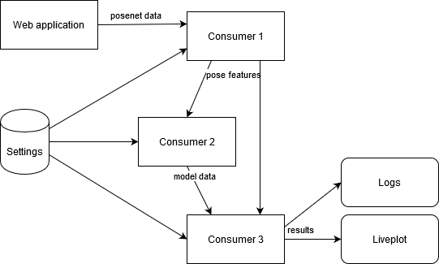
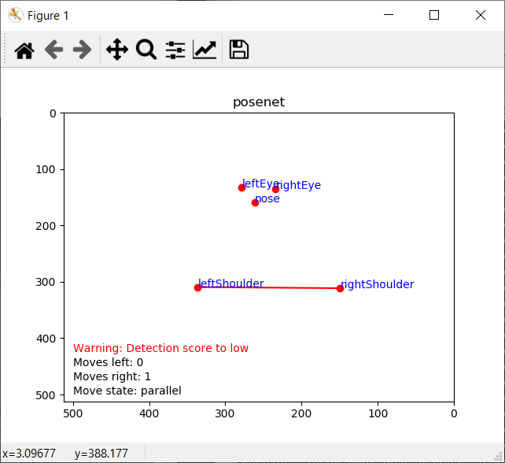

# Smart Systems Labs

## Group
- Joep van Benten
- Walaa Khalili
- Akshit Bhardwaj

## Labs status
- Lab 1: Finished except bonus question
- Lab 3: Finished
- Lab 4-5: Finished

## Lab 4-5
We have chosen to go for a movement which requires the shoulders to turn
(because Posenet could only  detect face and shoulder parts relatively accurate on one of our pc's).
A movement is successfully complete when the shoulders move from parallel, to a corner of x degrees and go back to parallel.

The following diagram shows our chosen architecture:

- Web application: 
  - Captures input from the webcam and uses Posenet to detect body parts.
  - Modified to include a time stamp (by Dirk)
- Consumer 1: 
  - Takes the Posenet data as input (17 body parts, reliability score and a time stamp).
  - Calculates the corner between the shoulders in degrees.
  - Calculates the speed of the corner adjustment over time.
  - Validates if the score of the detected body parts is sufficient.
    - Sends a warning when the score is to low.
  - Sends the pose features.
- Consumer 2:
  - Takes the pose features from Consumer 1 as input.
  - Applies the shoulder movement model.
    - Contains 3 states: parallel, turn_in, turn_out.
    - Validates if the user does not move to fast
      - Sends a warning when moved to fast.
    - Validates if the user completed the movement withing the expected time.
      - Sends a warning when move completed to slow.
  - Sends when the movement status.
- Consumer 3:
  - Takes the pose features from Consumer 1 as input.
  - Takes the movement status from Consumer 2 as input.
  - Counts the completed moves for each shoulder.
  - Shows all data in a live plot.
  - Saves all results in a log file.
- Database settings:
  - Contains all settings to improve system adaptability.
    - Consumer 1: the minimum score of the body parts.
    - Consumer 2: start and end corner of each movement, movement verification settings.
    - Consumer 3: duration of a waring for the live plot
  - (Currently implemented as a python file)

### Results
The live plot shows the received poses, model status and warnings from Consumer 1 and 2. 
Also the number of completed moves for each shoulder are visualized.

Consumer 3 contains a logger to save the received data offline.
An example of the INFO (and levels above) logs can be seen [here](lab4-5/output.log).

### Future improvements
- Implement database, currently are all settings stored in the config.py file.
- Improve smoothness by adaptive filtering the incoming poses. 
- Improve calculations of 'corner' and 'speed of corner' by using more samples.
- Increase sample rate, which is currently around 0.7 sec.
